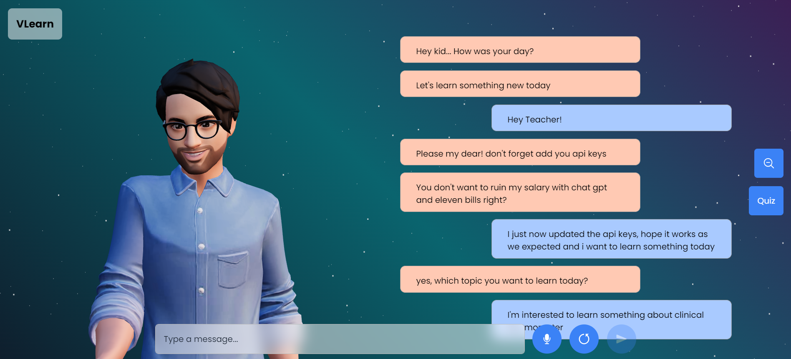

# VLearn

### Credits💫

>GitHub [@RionDsilvaCS](https://github.com/RionDsilvaCS)  ·  Linkedin [@Rion Dsilva](https://www.linkedin.com/in/rion-dsilva-043464229/)

>GitHub [@puneethx](https://github.com/puneethx)        ·  Linkedin [@Puneeth Reddy](https://www.linkedin.com/in/puneeth-reddy-75069824b/)

>GitHub [@Jahnavi0504](https://github.com/Jahnavi0504)        ·  Linkedin [@CH V N S Jahnavi](https://www.linkedin.com/in/ch-v-n-s-jahnavi-51a8ab259/)

>GitHub [@AswiniMitikiri](https://github.com/AswiniMitikiri)        ·  Linkedin [@Aswini Mitikiri](https://www.linkedin.com/in/aswini-mitikiri-068a2a245/)
